# 原神lgbt编剧

https://bbs.nga.cn/read.php?tid=40031250

sisi jiang，跨性别者和同性恋者。前kotaku记者，现原神编剧(负责原神英文频道版本前瞻视频和hoyofair同人视频的编剧)。

在玩家门2.0，"游戏编剧顾问公司"Sweet Baby Inc事件不断发酵，愈演愈烈时，sisi jiang发布了如下内容(gpt4.0翻译)：

> 我需要每个人都牢牢记住，绝大多数玩家都希望游戏中有女性/边缘群体的身影，而那些不希望的只是一小撮非常非常小(但又很吵)的声音。那些喷子就是失败者(字面意思)，而我们战胜他们的方法就是让他们得不到关注。他们之所以愤怒是因为多样性赢得了文化战，绝对没有任何跺脚发泄能够把时钟倒回去。

此外他还有如下言论：
> 每当我读到有人评论说《原神》不可能有同性恋内容，因为“那是一款中国游戏，而且zhonggong打压”，我就想撞桌子。实际上，全世界的游戏开发领域都广泛存在着酷儿文化。
> 
>风花节期间班尼特给雷泽写了一首情诗，现在逐月节期间行秋又给重云读爱情故事...米哈游真的很爱给同性恋者喂食呀。
> 
> 我不敢相信《崩坏：星穹铁道》通过让所有男性角色穿上带奶窗的衣服来实现了性别平等。
> ...

===此外还包括大量无法展示的涉政言论===

米哈游全球公关John Shen在sisi jiang入职米哈游后与其亲切互动。他曾在多个LGBT相关组织和知名同志社交软件Blued担任重要职位。

在LGBT组织北京同志中心的工作中，他担任了发展主管，带领了职场多元计划。而他在加入米哈游后的工作内容包括在公司层面制定企业社会责任(CSR)的策略，其带领职场多元计划的经历就发挥了作用，合理猜测更多的sisi jiang已经或即将加入米哈游。

综上所述，米哈游正在大力实现游戏内容和公司员工的双重多元化，政治正确化。farewell otaku

* [玩家门|kotaku](./玩家门.html)

## 工作证明

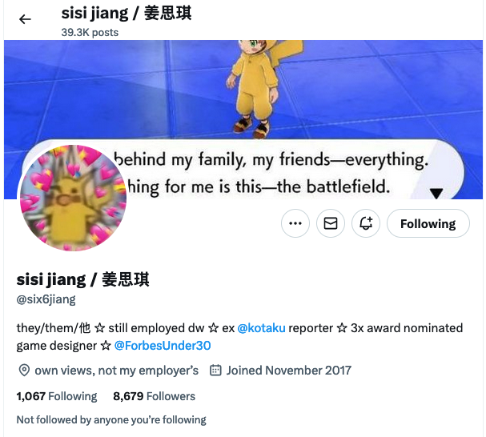  
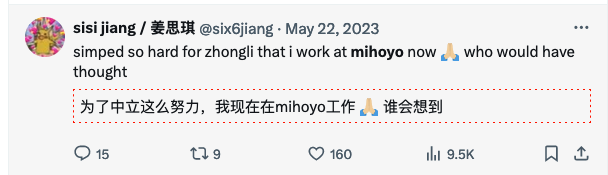  
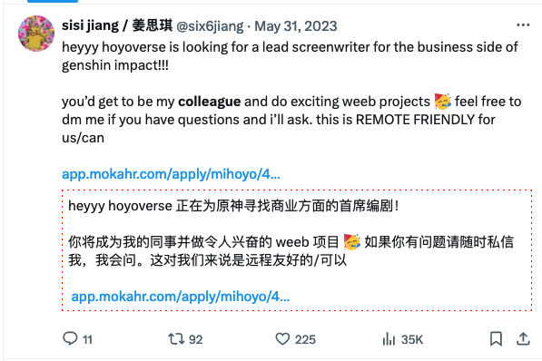  

## gay

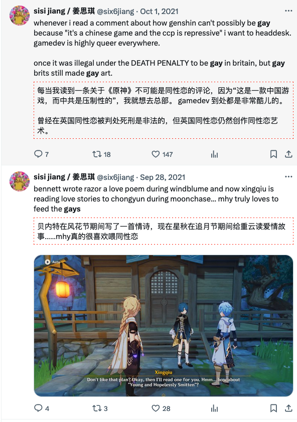  
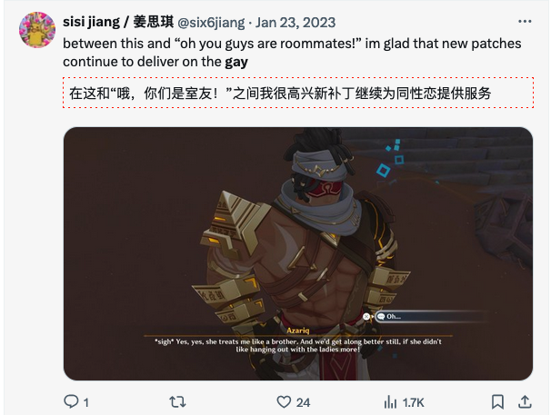  
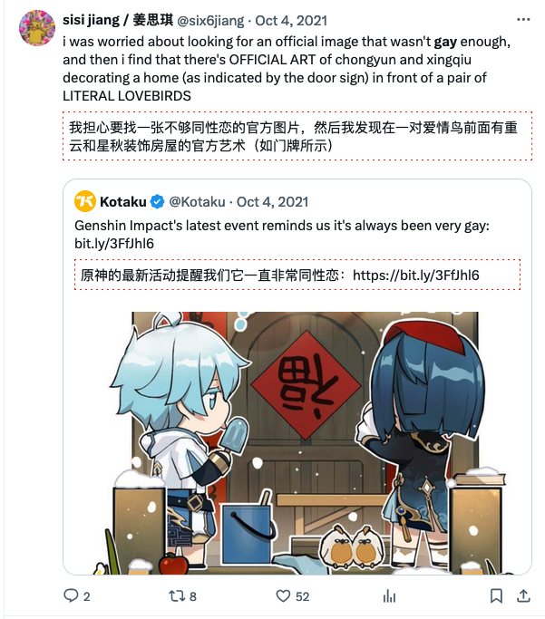  
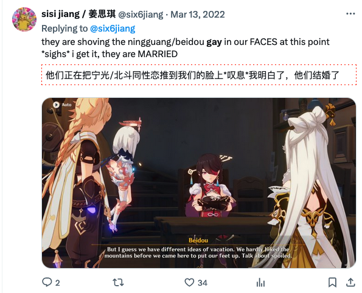  
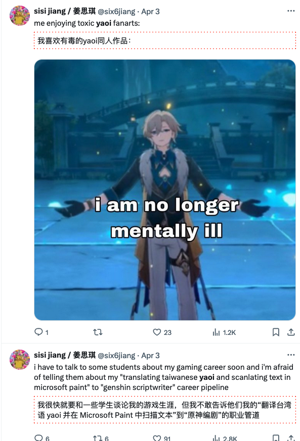  
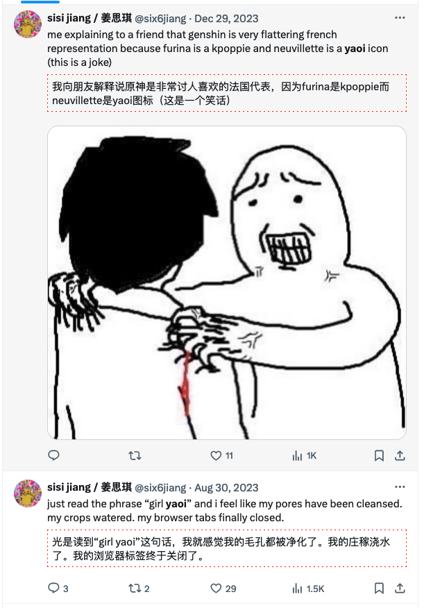  
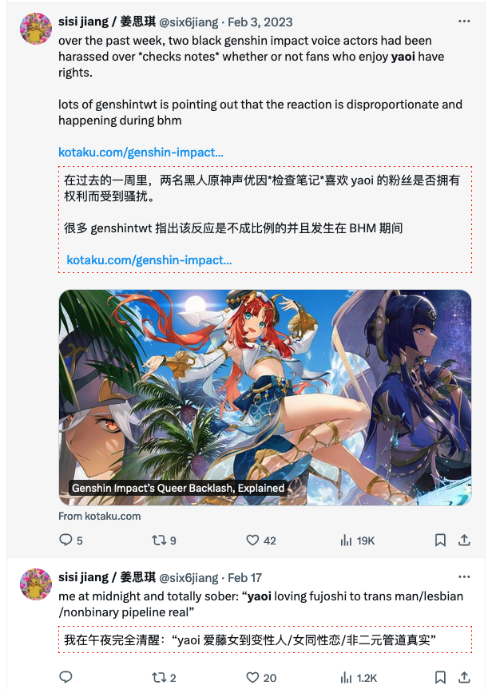  
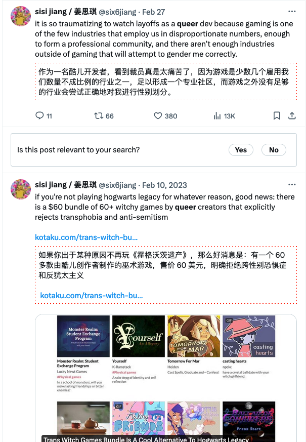  
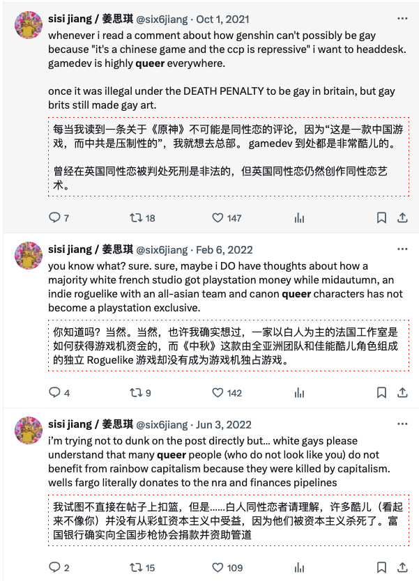  
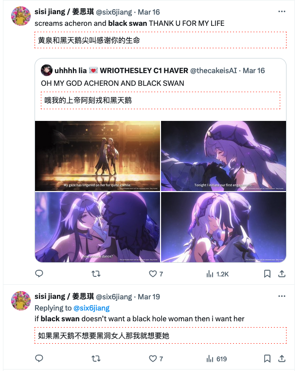  
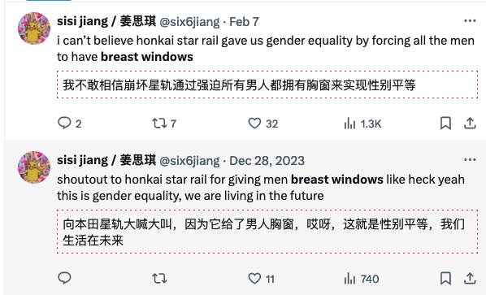  
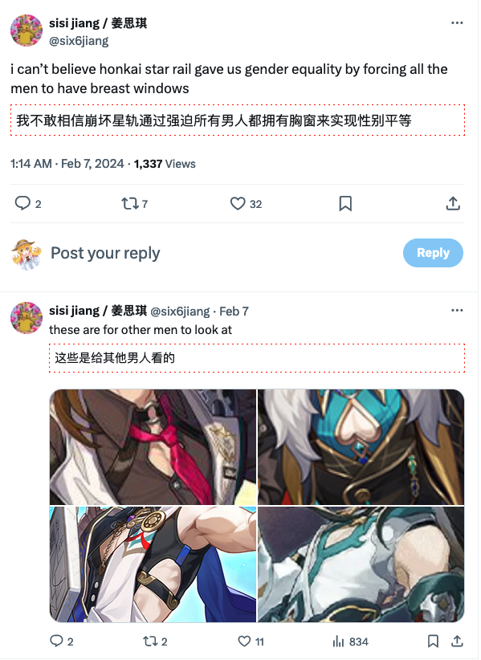  
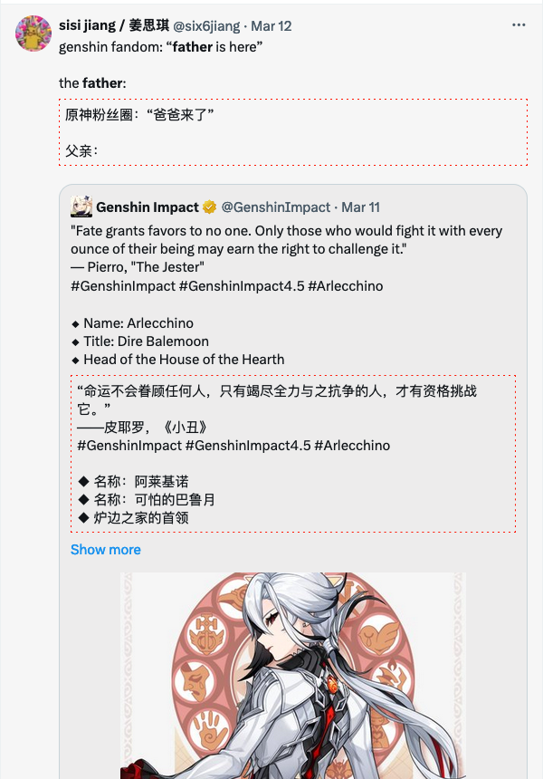  

## 港

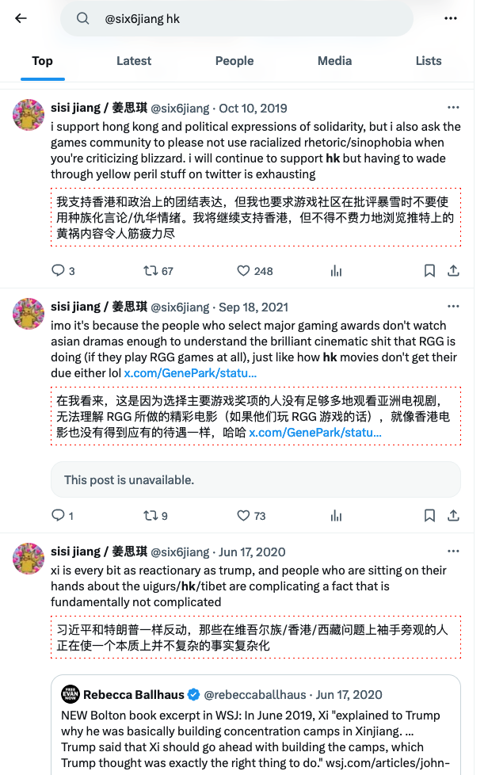  
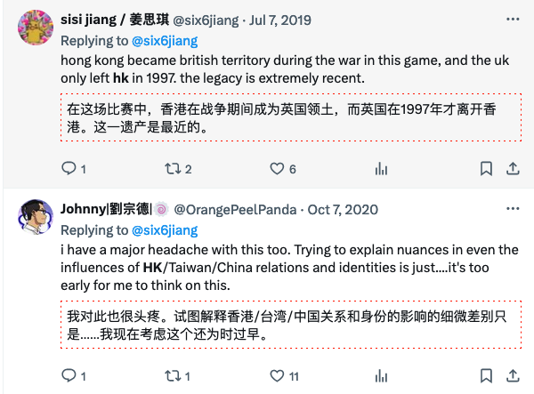  
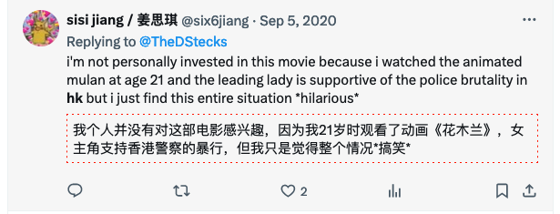  

## 中

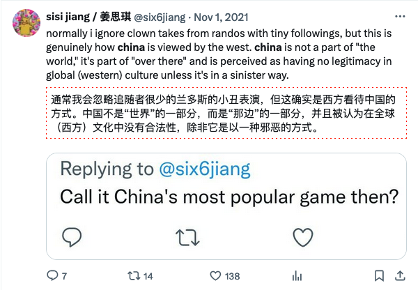  

## 台

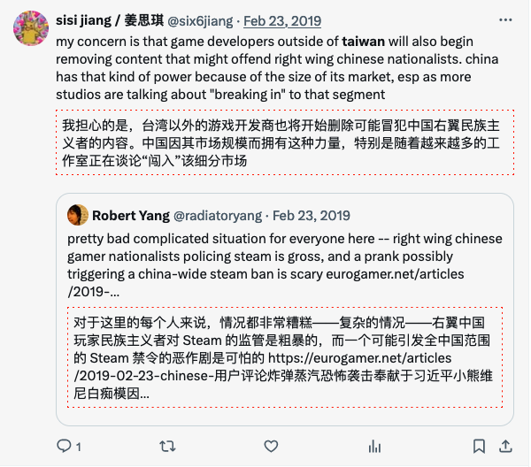  